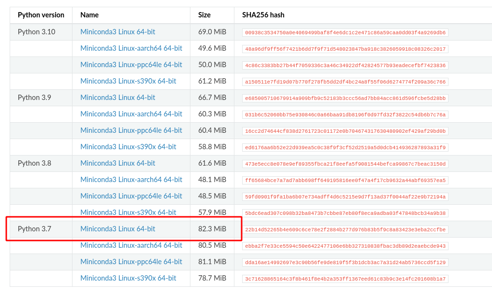

# Sen2Like <!-- omit in toc -->

## Table of content <!-- omit in toc -->

TOC Generated with markdown all in one: https://github.com/yzhang-gh/vscode-markdown

- [Retrieve sources of sen2like](#retrieve-sources-of-sen2like)
- [Local install](#local-install)
  - [Prerequisite](#prerequisite)
    - [libGL](#libgl)
    - [Conda](#conda)
- [Docker](#docker)
  - [Prerequisite](#prerequisite-1)
  - [Build sen2like docker image](#build-sen2like-docker-image)
  - [Docker store in repository](#docker-store-in-repository)
- [Running the tool](#running-the-tool)
  - [Local install](#local-install-1)
  - [Docker](#docker-1)
  - [sen2like usage](#sen2like-usage)
  - [Configuration file](#configuration-file)
    - [Processing](#processing)
    - [Directories](#directories)
    - [Downloader](#downloader)
      - [Local](#local)
      - [Creodias API](#creodias-api)
    - [Geometry](#geometry)
    - [Atmcor](#atmcor)
    - [Nbar](#nbar)
    - [Fusion](#fusion)
    - [Stitching](#stitching)
    - [OutputFormat](#outputformat)
    - [COGoptions](#cogoptions)
    - [JPEG2000options](#jpeg2000options)
    - [Multiprocessing](#multiprocessing)
    - [Packager](#packager)
    - [Runtime](#runtime)
  - [Command line arguments](#command-line-arguments)
    - [Product mode](#product-mode)
    - [Single tile mode](#single-tile-mode)
    - [Multi tile mode](#multi-tile-mode)
    - [ROI based mode](#roi-based-mode)
- [Release notes](#release-notes)
- [License](#license)

## Retrieve sources of sen2like

* Using git :

```bash
git clone https://github.com/senbox-org/sen2like.git
```

* Or from a [downloaded archive](https://github.com/senbox-org/sen2like/archive/refs/heads/master.zip):

```bash
unzip sen2like.zip
```

* Enter sen2like root source folder: 

```bash
cd sen2like/sen2like
```

## Local install

### Prerequisite

#### libGL

You will need `libGL` for linux, depending on your distribution it can be `libgl1-mesa-glx`, `mesa-libGL` or another. Install it if you don't have it yet.

#### Conda

sen2like needs a [conda](https://docs.conda.io/en/latest/) env to work.

We recommend to use miniconda.

To install miniconda, please refer to the miniconda documentation : https://docs.conda.io/en/latest/miniconda.html#

**As sen2like is based on python 3.10 it is recommended to install miniconda with python 3.10 but it is fine with conda having another version of python**



* Create a conda virtual environment with required packages

Once you retrieved the code, go into `sen2like` root source folder and run the following command to create a conda env named `sen2like`:

```bash
conda create -n sen2like --file requirements.txt -c conda-forge
```

* Activate conda virtual environment

```bash
conda activate sen2like
```

* Verify your sen2like installation with `python sen2like.py`, that should display sen2like CLI usage: 

```bash
python sen2like.py 
[INFO    ] 2023-01-11 14:50:54 - sen2like             - Run Sen2like 4.3.0
usage: sen2like.py [-h] [--version] [--refImage PATH] [--wd PATH]
                   [--conf PATH] [--confParams STRLIST] [--bands STRLIST]
                   [--allow-other-srs] [--no-run] [--intermediate-products]
                   [--parallelize-bands] [--debug] [--no-log-date]
                   {product-mode,single-tile-mode,multi-tile-mode,roi-based-mode}
                   ...
....
```

*Note: output is deliberately truncated*

## Docker

### Prerequisite

You need docker engine in order to build and execute sen2like with docker.

Please refer to the docker documentation to install docker on your environnement : https://docs.docker.com/engine/install/

### Build sen2like docker image

From the sen2like root directory (the one containing `Dockerfile`)

```bash
docker build -t sen2like . && docker image prune --filter label=stage=sen2like_build -f
```

The result is a docker image with tag `sen2like:latest`

*Note: In the previous command `docker image prune` instruction remove intermediate docker image created for the build.*

### Docker store in repository

You might want to store the builded docker image on your internal docker registry.

for this purpose, tag the image so that is points to your registry

```bash
docker tag --help

Usage:  docker tag SOURCE_IMAGE[:TAG] TARGET_IMAGE[:TAG]

Create a tag TARGET_IMAGE that refers to SOURCE_IMAGE
```

Example

```bash
docker image tag sen2like my-internal-docker-registry-url/sen2like:4.3
```

Push the image on a registry with the command `docker push NAME[:TAG]`

Example

```bash
docker push my-internal-docker-registry-url/sen2like:4.3
```

## Running the tool

### Local install

After install.

Python script sen2like.py could be found in cloned git repository, or unzipped folder.

For example if git cloned in home directory:

```bash
/opt/anaconda3/bin/python "$HOME/sen2like/sen2like/sen2like.py" single-tile-mode 31TFJ --conf "./config.ini" --start-date 2017-10-30 --end-date 2017-10-31 --wd "/data/production" --refImage "/data/References/GRI/S2A_OPER_MSI_L1C_TL_MPS__20161018T120000_A000008_T31TFJ_N01.01/IMG_DATA/S2A_OPER_MSI_L1C_TL_MPS__20161018T120000_A000008_T31TFJ_B04.jp2" --bands B04
```

### Docker

Build sen2like docker image or pull it from a registry with the command `docker pull NAME[:TAG]`

Example :

```bash
docker pull https://my-internal-docker-registry-url/sen2like:4.3
```

You can run it directly without entering into the container: 

```bash
docker run --rm my-internal-docker-registry-url/sen2like/sen2like:4.3

[INFO    ] 2023-01-11 14:50:54 - sen2like             - Run Sen2like 4.3.0
usage: sen2like.py [-h] [--version] [--refImage PATH] [--wd PATH]
                   [--conf PATH] [--confParams STRLIST] [--bands STRLIST]
                   [--allow-other-srs] [--no-run] [--intermediate-products]
                   [--parallelize-bands] [--debug] [--no-log-date]
                   {product-mode,single-tile-mode,multi-tile-mode,roi-based-mode}
                   ...

positional arguments:
....
```

In the following examples **local** folder `/data` is supposed to exist and contains :
- sen2like config file `/data/config.ini` 
- a folder for working `/data/production` 
- the reference image `/data/References/GRI/S2A_OPER_MSI_L1C_TL_MPS__20161018T120000_A000008_T31TFJ_N01.01/IMG_DATA/S2A_OPER_MSI_L1C_TL_MPS__20161018T120000_A000008_T31TFJ_B04.jp2`


```bash
docker run --rm \
  --mount type=bind,source="/data",target=/data \
  my-internal-docker-registry-url/sen2like/sen2like:4.3 \
  single-tile-mode 31TFJ \
  --conf "/data/config.ini" \
  --start-date 2017-10-30 --end-date 2017-10-31 \
  --wd "/data/production" \
  --refImage "/data/References/GRI/S2A_OPER_MSI_L1C_TL_MPS__20161018T120000_A000008_T31TFJ_N01.01/IMG_DATA/S2A_OPER_MSI_L1C_TL_MPS__20161018T120000_A000008_T31TFJ_B04.jp2" \
  --bands B04
```

Python script `sen2like.py` could be accessed from a docker container.

Launch the docker binding **local** `/data` folder to the container `/data` folder, example: 

```bash
docker run --rm -it --mount type=bind,source="/data",target=/data --entrypoint=/bin/bash my-internal-docker-registry-url/sen2like/sen2like:4.3

root@15a2f44ddd70:/usr/local/sen2like

```

In prompt execute ./sen2like.py as follow: 

```bash
./sen2like.py single-tile-mode 31TFJ \
  --conf "/data/config.ini" \ 
  --start-date 2017-10-30 --end-date 2017-10-31 \
  --wd "/data/production" \
  --refImage "/data/References/GRI/S2A_OPER_MSI_L1C_TL_MPS__20161018T120000_A000008_T31TFJ_N01.01/IMG_DATA/S2A_OPER_MSI_L1C_TL_MPS__20161018T120000_A000008_T31TFJ_B04.jp2" \
  --bands B04
```

### sen2like usage

Sen2like can be run in three different modes:

* `product-mode`: Run the tool on a singe product
* `single-tile-mode`: Run the tool on a MGRS tile. Corresponding products will be loaded.
* `multi-tile-mode`: Run the tool on a ROI defined in a geojson. Corresponding MGRS tile will be inferred and products will be loaded. It is equivalent to run a single-tile mode for each matching tile. In multi-tile mode, multiprocessing can be used to speed-up computation time.
* `roi-based-mode`: Run the tool on a ROI defined in a geojson.

The configuration of the tool is done by command-line arguments and by a configuration file. A default configuration
file is provided in `conf/config.ini`.

### Configuration file

Two configuration file formats are supported:

* Ini file
* GIPP file (xml-like)

The configuration file is divided in several parts, each describing specific block of processing.

#### Processing

Enable or disable a processing block based on value `(True, False)`:

* `doGeometry`: Run the geometric correction and reframing processing using KLT
* `doStitching`: Run the stitching processing
* `doGeometryCheck`: Run the geometric assessment using KLT to compute geometry QI
* `doToa`: Run the TOA correction
* `doInterCalibration`: Run the Inter Calibration correction (S2B)
* `doAtmcor`: Run the Atmospheric correction (SMAC or Sen2Cor)
* `doNbar`: Run Nbar correction processing
* `doSbaf`: Run the Sbaf correction processing
* `doFusion`: Run the Fusion processing
* `doPackagerL2H`: Run the packaging processing for harmonized products
* `doPackagerL2F`: Run the packaging processing for fused products

#### Directories

Indicates path for special directories:

* `archive_dir`: Where the L2H and L2F output products are generated
* `cams_dir`: Where the CAMS files are located
* `cams_daily_dir`: Where the CAMS daily files are located 
* `cams_hourly_dir`: Where the CAMS hourly files are located 
* `cams_climatology_dir`: Where the CAMS climatology files are located 
* `dem_dir`: Where the DEM files are located 
* `scl_dir`: Where the auxiliary scl maps files are located 

#### Downloader

Describes parameters for product acquisition.

By default, two method are described:

* **local**: products are stored in local
* **creodias**: products are located using the creodias api

Other access method can be defined by defining custom attributes, in order to use other API.

To define path, custom attributes can be defined in the configuration file.

* `coverage`: Define the coverage of the product tile in the interval [0, 1 ] (0-100%)

In addition these parameters are defined in the tool and can be used in brackets `{}`:

* `mission`: `Landsat8` or `Sentinel2`
* `tile`: MGRS tile
* `path`: WRS path
* `row`: WRS row

##### Local

* `base_url`: Specify where the products are stored
* `cloud_cover`: Maximum cloud cover in percent [0, 100]
* `url_parameters_pattern_Sentinel2`: Describe storage path for Sentinel 2 products
* `url_parameters_pattern_Landsat8`: Describe storage path for Landsat 8 products
* `url_parameters_pattern_Landsat9`: Describe storage path for Landsat 9 products

For a Sentinel 2 product on tile 31TFJ:

```ini
base_url = /data/PRODUCTS
url_parameters_pattern_Sentinel2 = {base_url}/{mission}/{tile}
```

will be replaced by:

```ini
url_parameters_pattern_Sentinel2 = /data/PRODUCTS/Sentinel2/31TFJ
```

##### Creodias API

* `base_url`: Base address of the api
* `cloud_cover`: Maximum cloud cover in percent [0, 100]
* `location_Landsat8`: Expression specifiying Landsat 8 filter
* `location_Sentinel2`: Expression specifiying Seninel 2 filter
* `url_parameters_pattern`: API request url. Special parameters between brackets are replaced by defined attributes
* `thumbnail_property`: Path in result json where product path is stored
* `cloud_cover_property`: Path in result json where cloud cover is stored
* `gml_geometry_property`:  Path in result json where gml geometry is stored


#### Geometry

Define parameters for geometric correction.

* `reference_band`= The reference band to be used for geometric correction
* `doMatchingCorrection`: Apply the matching correction (`True`, `False`)
* `doAssessGeometry`: Assess geometry (Band list separated by comma.)
* `references_map`: Path to the reference json file containing the reference image for each tile
* `force_geometry_correction`: Do geometry correction even if product is refined (S2 mission)

#### Atmcor

Atmospheric correction method to use.

* `use_sen2cor`: Activate sen2cor for Atmospheric correction (SMAC otherwise)
* `sen2cor_path`: Path to sen2cor tool command (L2A_Process.py)

#### Nbar

Define parameters for Nbar processing.

* `nbar_methode`: Method to get BRDF coefficients. Currently, available methods are : ROY, VJB
* `vjb_coeff_matrice_dir`: If VJB method is selected, directory path of the BRDF coefficients netcdf file

#### Fusion

Define parameters for Fusion processing.

* `predict_method` : Predict method to be used (predict or composite using most recent valid pixels)
* `predict_nb_products`: Number of products needed by predict method
* `fusion_auto_check_band` : Band on which the fusion auto check is performed
* `fusion_auto_check_threshold` : (in [0,1]) Threshold on fusion auto check difference. Used to generate FCM mask.

#### Stitching

Define parameters for stitching processing.

* `same_utm_only`: Enable or disable stitching with product on different UTM as current processed product.  
  For Landsat it allows to use previous or next product that can be on another UTM for stitching and have a better tile coverage.

#### OutputFormat

Define output format, gain and offset for image files.

* `gain`: DN Quantification value of output image (DN to reflectance conversion)
* `offset`: DN Offset to substract from the output image (DN to reflectance conversion)
* `output_format`: Format of the output image. Supported formats: COG, GTIFF (for geotiff), JPEG2000.

*Note: DN to reflectance conversion: reflectance = (DN - offset) / gain *

#### COGoptions

* `interleave`: Interleave mode
* `internal_tiling`: Internal tiling resolution
* `internal_overviews`: Internal overviews sampling
* `downsampling_levels_$RES$`: COG pyramids sampling level for $RES$ (ie: 10, 15...).  
  This keyword can be `present` several times for multiple resolutions.

* `downsampling_levels`: Downsampling levels mode
* `resampling_algo_MASK`: Resampling algorithm for masks
* `resampling_algo`: Resampling algorithm for images
* `compression`: Compression mode
* `predictor`: Predicator value

#### JPEG2000options

* `lossless_jpeg2000`: Indicates if jpeg2000 output should be lossless (`True`or `False`)

#### Multiprocessing

Define parameters for multiprocessing in multi-tile-mode.

* `number_of_process`: Maximum number of processes to start

#### Packager

Define packaging parameters.

* `quicklook_jpeg_quality`: JPEG Quality for quicklooks
* `json_metadata`: Indicates if metadata are also written as json (`True` or `False`)

#### Runtime

This section is overridden during runtime and contains backup of computed values. Modifying this section will have no
effect.

### Command line arguments

The help of the tool can be displayed with the command:
```
python sen2like.py --help
```

```
usage: sen2like.py [-h] [--version] [--refImage PATH] [--wd PATH]
                   [--conf PATH] [--confParams STRLIST] [--bands STRLIST]
                   [--allow-other-srs] [--no-run] [--intermediate-products]
                   [--parallelize-bands] [--debug] [--no-log-date]
                   {product-mode,single-tile-mode,multi-tile-mode,roi-based-mode}
                   ...

positional arguments:
  {product-mode,single-tile-mode,multi-tile-mode,roi-based-mode}
                        Operational mode
    product-mode        Process a single product
    single-tile-mode    Process all products on a MGRS tile
    multi-tile-mode     Process all products on a ROI
    roi-based-mode      Process all products that fully contains an ROI. The
                        ROI footprint must be FULLY INSIDE a MGRS tile.

optional arguments:
  -h, --help            show this help message and exit
  --version, -v         show program's version number and exit
  --refImage PATH       Reference image (use as geometric reference)
  --wd PATH             Working directory (default : /data/production/wd)
  --conf PATH           S2L_configuration file (Default:
                        SEN2LIKE_DIR/conf/S2L_config.ini)
  --confParams STRLIST  Overload parameter values (Default: None). Given as a
                        "key=value" comma-separated list. Example:
                        --confParams "doNbar=False,doSbaf=False"
  --bands STRLIST       S2 bands to process as coma separated list (Default:
                        ALL bands)
  --allow-other-srs     Selected product to process can have another SRS/UTM
                        than the one of the S2 tile (default: False)
  --no-run              Do not start process and only list products (default:
                        False)
  --intermediate-products
                        Generate intermediate products (default: False)
  --parallelize-bands   Process bands in parallel (default: False)

Debug arguments:
  --debug, -d           Enable Debug mode (default: False)
  --no-log-date         Do no store date in log (default: False)

```

#### Product mode

In product mode, a product is specified and processed by the tool.

The help of the product-mode can be displayed with the command:

```bash
python sen2like.py product-mode --help
```

```
usage: sen2like.py product-mode [-h] [--version] [--refImage PATH] [--wd PATH]
                                [--conf PATH] [--confParams STRLIST]
                                [--bands STRLIST] [--allow-other-srs]
                                [--no-run] [--intermediate-products]
                                [--parallelize-bands] [--debug]
                                [--no-log-date] --tile TILE
                                product

positional arguments:
  product               Landsat8 L1 product path / or Sentinel2 L1C product
                        path

optional arguments:
  -h, --help            show this help message and exit
  --version, -v         show program's version number and exit
  --refImage PATH       Reference image (use as geometric reference)
  --wd PATH             Working directory (default : /data/production/wd)
  --conf PATH           S2L_configuration file (Default:
                        SEN2LIKE_DIR/conf/S2L_config.ini)
  --confParams STRLIST  Overload parameter values (Default: None). Given as a
                        "key=value" comma-separated list. Example:
                        --confParams "doNbar=False,doSbaf=False"
  --bands STRLIST       S2 bands to process as coma separated list (Default:
                        ALL bands)
  --allow-other-srs     Selected product to process can have another SRS/UTM
                        than the one of the S2 tile (default: False)
  --no-run              Do not start process and only list products (default:
                        False)
  --intermediate-products
                        Generate intermediate products (default: False)
  --parallelize-bands   Process bands in parallel (default: False)
  --tile TILE           Id of the MGRS tile to process

Debug arguments:
  --debug, -d           Enable Debug mode (default: False)
  --no-log-date         Do no store date in log (default: False)
```

Example of command line:

```bash
python sen2like.py product-mode /eodata/Sentinel-2/MSI/L1C/2017/01/03/S2A_MSIL1C_20170103T104432_N0204_R008_T31TFJ_20170103T104428.SAFE --wd ~/wd --tile 31TFJ --bands B04
```

#### Single tile mode

In single-tile mode, a MGRS tile is specified and processed by the tool.

The help of the single-tile-mode can be displayed with the command:

```bash
python sen2like.py single-tile-mode --help
```

```
usage: sen2like.py single-tile-mode [-h] [--start-date START_DATE]
                                    [--end-date END_DATE] [--l2a] [--version]
                                    [--refImage PATH] [--wd PATH]
                                    [--conf PATH] [--confParams STRLIST]
                                    [--bands STRLIST] [--allow-other-srs]
                                    [--no-run] [--intermediate-products]
                                    [--parallelize-bands] [--debug]
                                    [--no-log-date]
                                    tile

positional arguments:
  tile                  Id of the MGRS tile to process

optional arguments:
  -h, --help            show this help message and exit
  --start-date START_DATE
                        Beginning of period (format YYYY-MM-DD)
  --end-date END_DATE   End of period (format YYYY-MM-DD)
  --l2a                 Processing level Level-2A for S2 products if set
                        (default: L1C)
  --version, -v         show program's version number and exit
  --refImage PATH       Reference image (use as geometric reference)
  --wd PATH             Working directory (default : /data/production/wd)
  --conf PATH           S2L_configuration file (Default:
                        SEN2LIKE_DIR/conf/S2L_config.ini)
  --confParams STRLIST  Overload parameter values (Default: None). Given as a
                        "key=value" comma-separated list. Example:
                        --confParams "doNbar=False,doSbaf=False"
  --bands STRLIST       S2 bands to process as coma separated list (Default:
                        ALL bands)
  --allow-other-srs     Selected product to process can have another SRS/UTM
                        than the one of the S2 tile (default: False)
  --no-run              Do not start process and only list products (default:
                        False)
  --intermediate-products
                        Generate intermediate products (default: False)
  --parallelize-bands   Process bands in parallel (default: False)

Debug arguments:
  --debug, -d           Enable Debug mode (default: False)
  --no-log-date         Do no store date in log (default: False)
```

Example of command line:

```bash
python sen2like.py single-tile-mode 31TFJ --wd ~/wd --refImage /data/HLS/31TFJ/L2F_31TFJ_20170103_S2A_R008/L2F_31TFJ_20170103_S2A_R008_B04_10m.TIF
```

#### Multi tile mode

In multi-tile mode, a geojson file is specified and processed by the tool. An example of geojson file containing tile
31TFJ is located in `conf/tile_mgrs_31TFJ.json`.

The help of the multi-tile-mode can be displayed with the command:

```bash
python sen2like.py multi-tile-mode --help
```

```
usage: sen2like.py multi-tile-mode [-h] [--start-date START_DATE]
                                   [--end-date END_DATE] [--l2a] [--jobs JOBS]
                                   [--version] [--refImage PATH] [--wd PATH]
                                   [--conf PATH] [--confParams STRLIST]
                                   [--bands STRLIST] [--allow-other-srs]
                                   [--no-run] [--intermediate-products]
                                   [--parallelize-bands] [--debug]
                                   [--no-log-date]
                                   roi

positional arguments:
  roi                   Json file containing the ROI to process

optional arguments:
  -h, --help            show this help message and exit
  --start-date START_DATE
                        Beginning of period (format YYYY-MM-DD)
  --end-date END_DATE   End of period (format YYYY-MM-DD)
  --l2a                 Processing level Level-2A for S2 products if set
                        (default: L1C)
  --jobs JOBS, -j JOBS  Number of tile to process in parallel
  --version, -v         show program's version number and exit
  --refImage PATH       Reference image (use as geometric reference)
  --wd PATH             Working directory (default : /data/production/wd)
  --conf PATH           S2L_configuration file (Default:
                        SEN2LIKE_DIR/conf/S2L_config.ini)
  --confParams STRLIST  Overload parameter values (Default: None). Given as a
                        "key=value" comma-separated list. Example:
                        --confParams "doNbar=False,doSbaf=False"
  --bands STRLIST       S2 bands to process as coma separated list (Default:
                        ALL bands)
  --allow-other-srs     Selected product to process can have another SRS/UTM
                        than the one of the S2 tile (default: False)
  --no-run              Do not start process and only list products (default:
                        False)
  --intermediate-products
                        Generate intermediate products (default: False)
  --parallelize-bands   Process bands in parallel (default: False)

Debug arguments:
  --debug, -d           Enable Debug mode (default: False)
  --no-log-date         Do no store date in log (default: False)
```

Example of command line:

```bash
python sen2like.py multi-tile-mode ROI_FILE --wd ~/wd --refImage /data/HLS/31TFJ/L2F_31TFJ_20170103_S2A_R008/L2F_31TFJ_20170103_S2A_R008_B04_10m.TIF
```

#### ROI based mode

In roi-based-mode, a geojson file is specified and processed by the tool.

The help of the roi-based-mode can be displayed with the command:

```bash
python sen2like.py roi-based-mode --help
```

```
usage: sen2like.py roi-based-mode [-h] [--tile TILE] [--start-date START_DATE]
                                  [--end-date END_DATE] [--l2a] [--version]
                                  [--refImage PATH] [--wd PATH] [--conf PATH]
                                  [--confParams STRLIST] [--bands STRLIST]
                                  [--allow-other-srs] [--no-run]
                                  [--intermediate-products]
                                  [--parallelize-bands] [--debug]
                                  [--no-log-date]
                                  roi

positional arguments:
  roi                   Json file containing the ROI to process

optional arguments:
  -h, --help            show this help message and exit
  --tile TILE           MGRS Tile Code : Force Processing of a specific tile
                        in case several MGRS tiles contain the ROI footprint
  --start-date START_DATE
                        Beginning of period (format YYYY-MM-DD)
  --end-date END_DATE   End of period (format YYYY-MM-DD)
  --l2a                 Processing level Level-2A for S2 products if set
                        (default: L1C)
  --version, -v         show program's version number and exit
  --refImage PATH       Reference image (use as geometric reference)
  --wd PATH             Working directory (default : /data/production/wd)
  --conf PATH           S2L_configuration file (Default:
                        SEN2LIKE_DIR/conf/S2L_config.ini)
  --confParams STRLIST  Overload parameter values (Default: None). Given as a
                        "key=value" comma-separated list. Example:
                        --confParams "doNbar=False,doSbaf=False"
  --bands STRLIST       S2 bands to process as coma separated list (Default:
                        ALL bands)
  --allow-other-srs     Selected product to process can have another SRS/UTM
                        than the one of the S2 tile (default: False)
  --no-run              Do not start process and only list products (default:
                        False)
  --intermediate-products
                        Generate intermediate products (default: False)
  --parallelize-bands   Process bands in parallel (default: False)

Debug arguments:
  --debug, -d           Enable Debug mode (default: False)
  --no-log-date         Do no store date in log (default: False)
```

## [Release notes](./release-notes.md)

## License

[Apache License 2.0](./LICENSE.txt)
